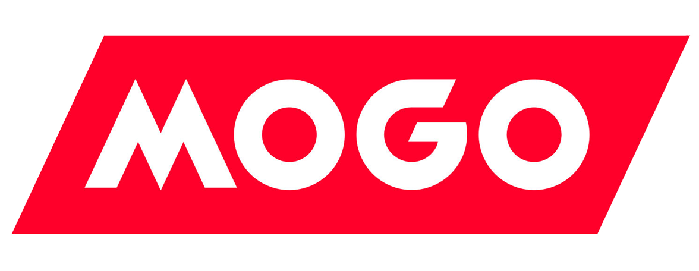

## CASE STUDY

# MOGO FINANCE TECHNOLOGY INC.

## Overview and Origin

Mogo Finance Technology Inc is a Vancouver based company founded by brothers David and Gregory Feller in 2003. The brothers identified a crisis with credit card debt at that time and decided to bridge the gap by providing transparent and simple personal loans to costumers. The idea to offer simple and transparent loans to customers has since evolved. Ideas born out of existing financial gaps have since been added to offer it's Members a number of services including blockchain capabilities.  

**Mogo Finance's core value proposition is to simplify the process for consumers to manage Financial health by combining key FinTech (Financial Technology) developments while contributing to climate change.**

Mongo has raised $263.8M to date with investors including Fortress Investment Group and Difference Group. It completed its IPO on the Toronto Stock Exchange in 2015.
Mongo closed funding round on Feb 22, 2021 from a Post-IPO Equity round. 

---

## Business Activities:

With 64% of Canadians in debt and the most common being credit card debt,Mogo set out to find ways for Canadians to spend smarter, increase wealth and avoid debt traps like credit cards. 

With that in mind Mogo introduced free credit score monitoring on there platform bringing transparency to customers. The idea behind this was to enable Canadians have credit score visibility and understanding of personal credit score and how to improve it or maintain it. 
Canadians with poor credit score or those new to Canada might find themselves unable to access loans and if they do they will have a high interest. Mogo provides loan preapprovals that do not impact a consumers credit score. This can be very helpful if the credit score is already struggling. This online preapproval takes less than 4 minutes which is significantly less time compared to the average lender which can sometimes take a week or two depending on the process and the advisor working on the file.  

They offer small fixed term installment loans which are significantly easier and less expensive to pay off compared to credit card debt with compounding interest. These installment loans are flexible and can be paid in full at anytime with no penalty.

Alongside small loans Mogo also offers smart mortgages and unique prepaid visa debt card to its customers. Mogo has since evolved to add new products for its customers including Trading Platform, Cryptocurrency, Smart Saving account and Registered Savings account. 

---

Mogo is a millennial and next Gen focused brand. Standard banking methods can be time consuming and difficult to navigate in a changing Financial climate which is why Mogo is making banking more accessible and simplified which is important for today and the fast paced life we are now living. 
The introduction of commission free stock trading and blockchain technology to the platform made the company even more attractive to its end users and thus growing the companies market size. 
Mogo has since surpassed the 2 million member milestone as of June 30, 2022. 

---

What sets Mogo apart from competitors is their ability to offer small loans to customers at a fair or below market interest rate regardless the credit score. 

The use of technology has enabled the to process information faster, reduce wait time and present financial information to the consumer in a user friendly and easy to understand format.
Mogo is actively taking steps to reduce carbon footprint by directing funds to plant trees every time a member uses a Mogocard. This climate action has given them a spotlight in the market they are invested in. The whole world and especially Millennials and the younger generation are greatly concerned about the impact of global warming, tying a solution to their banking is very innovative.

---
## Technology used

Literature on the technology used by Mogo is difficult to come by with websites like [infiniums.com](http://infiniums.com/mogo-2/) listing Some of the technology used my Mogo to include HTML5, CSS3, JavaScript for front end development.
After several searches with no results I come across a job posting on [google](https://www.google.ca/search?source=hp&ei=PkvSWq7iIKXr5gLx9I_ABQ&btnG=Search&q=mogo+jobs&oq=node+run+global+module+other+user&gs_l=psy-ab.3..33i160k1.501.5624.0.5833.34.21.0.11.11.0.142.2088.11j10.21.0....0...1c.1.64.psy-ab..2.30.1932.0..0j35i39k1j0i67k1j0i131k1j0i131i67k1j0i20i263k1j0i22i30k1j33i21k1.0.4EKADFMmk4k&ibp=htl;jobs&sa=X&ved=2ahUKEwiHwMejqLb7AhU_kYkEHWWtA3UQkd0GegQIEBAB#fpstate=tldetail&htivrt=jobs&htiq=mogo+jobs&htidocid=xdmk8mPrtDAAAAAAAAAAAA%3D%3D&sxsrf=ALiCzsbPJJ0dbz-GLmYtlUm1EUPtfQ7igg:1668725865577) that named some of the technologies required for a back end job at Mogo. They included 
MySQL which  is used to manage data information. 
AWS and Docker which  are used for cloud storage. 

---

## Landscape:

Mogo is in the Financial Technology Domain and these have been some of the major trends and innovations in this Domain with in the last 5-10 years. 

Financial Technology has brought forth a faster, secure and less time consuming way of conducting transactions in the Financial industry. 
* We now have the ability to transfer money from anywhere to anyone with our mobile phones and in real time. 
* Consumers can now trade effortlessly from anywhere with access to an online trading platform.
* The need to be physically present in a bank for day to day transactions and been replaced by mobile and online banking.
* Opening of accounts and loan approvals are now done instantly and in the comfort of your own home.
* Financial Technology has caused major disruption in the traditional banking system forcing them to lower fees, become more transparent, simplified and have an online presence.
* FinTech has simplified financial planning. With the use of AI, consumers are able to see spending patterns, savings and cashflow. This information is used for the projection of a customers overall financial health which makes planning, budgeting and strategizing for financial growth less tedious. 
* The introduction of digital currency has brought about a new wave of banking and exchanging goods and services. The fact that digital currency has next to no regulations, is hard to detect and is now widely used has become very attractive in the financial climate. Consumers are continuously looking for ways to take control of their financials and digital currencies enables that freedom and control. 
---

Some of the major companies in the Financial Technology domain are:
*  Borrowell (Fintech lending company) 
* WealthSimple (Provides a saving and investment platform) 
* Lending Loop (Fintech company providing lending to small businesses)
---

This has been Mogos business impact so far?

Since Mogo started in 2003 offering free credit score check and small loans on the Platform, they have since accelerated and further enhanced products to enable them support their growing member base. Product enhancements include Mogo Trade (a trading platform), the ability to buy and sell cryptocurrency, automatic approval for account opening,  instant funding and ability to receive in-app monthly statements. 
Mogo's total member base has since increased by approximately 18% from 1695,000 in June 2021 to 2007,000 in June 2022
In alignment with the plan to help Canadians achieve financial freedom while addressing climate change, Mogo announced that it has reached one million trees milestone on April 22 2022. 
With climate change included in their business model, Mogo has been able to provide a Financial platform that provides its customers with an easy and accessible way to take climate action. Every time a customer uses a mogocard, a tree is planted. This has not only increased Mogos Member base but also addressed a critical issue the world is currently facing.

--- 

Some of the core metrics used by Financial Technology companies like Mogo who  provide automated banking services to customers are:
* Customer Onboarding and Retention as one of the core metrics to measure success. 
* Other metrics include, Cost of Customer Acquisition which is the cost of acquiring new customers compared against the acquired customers.

As of Q2 2022, Mogo's total Member base increased by 18% as of June 2022 despite reduced spending on marketing. Mogo saw a 26% increase in revenue including subscriptions and services revenue despite market volatility which is positive. 

---

## Compared to other FinTech Companies

Compared to Borrowell, WealthSimple and Lending Loop, Mogo Financial provides a wide variety of products and services to its Members. 

Borrowell is primarily focused on providing credit score and lending, WealthSimple is primarily focused on savings, registered accounts and investing and Lending Loop is mainly focused on providing loans to small businesses. 

Mogo provides not only credit score tracking and lending but also digital spending account, digital mortgage, identity fraud protection, trading platform and  the ability to trade digital currency. 
Mogo is also publicly listed which has enabled it to increase revenue for expansion. 
Based on product provision, Mogo ranks top among its competitors. 

With that in mind we have seen companies like Borrowell and WealthSimple growing rapidly and increasing in market size. 
Both WealthSimple and Borrowell are highly specialised in the services they offer making them the go to place for anyone looking for that particular service. 

For instance, Borrowell offers highly in depth and detailed credit score report with tailored advice on how one can improve or maintain their credit score. Borrowell also tailors financial recommendations to the customers needs plus transparent and comparably low loan interest rate. These features give Borrowell an advantage in the FinTech domain with consumers looking to improve credit and those who are not supported by A lenders for various reasons. 

WealthSimple has a well put together and user friendly trading platform in addition to the availability of registered accounts. This makes WealthSimple the go to for customers that are interested in long term saving and tax advantages. Mogo only started offering Registered accounts in 2022 long after WealthSimple was already offering the accounts making the competition very fierce. 

Much as all these companies are in the FinTech domain, they all have a unique way of offering products and catering to specific financial needs. Having said that, the ability for Mogo to offer a variety of products sets it apart from its competitors in a way that Mogo's customers can have all their banking under one platform. 

---

## Recommendations

One product and service that I would suggest that Mogo added is the ability to make Wills and Power of Attorney(POA) on the platform. 
Since Mogo's target market is Millennials (next generation), the following demographic doesn't always see the immediate need to put a Will together as well as a POA. This important need will always go overlooked by todays generation and yet it's a very crucial part of Financial planning. The younger generation often finds the process of putting a Will/POA together tedious and expensive due to the lawyer fees, time and paperwork involved in putting it all together. 

Having Mogo's customers have the ability to make a Will/POA on their platform will be of great benefit in the following ways:
The customers will have a start to finish banking service. As the customers life changes with time i.e having children and buying a home, the need to protect assets the need to plan for the unexpected also increases. 
This demographic will appreciate the ease of having their wealth accumulate, assets planned and looked after under one app. 

Including this service will not only increase Membership because of the ease but it will also build trust and retention with the company and in turn increase revenue.

Since Climate Change is part of Mogo's business model, offering this service will greatly reduce on the paperwork usually involved in process of making Wills/POAs contributing to a greener world. 

Having a Will/POA on file will simplify the process of reconciling bank accounts should anything happen to a customer. With banking going digital, dispatchment of proceeds after death can present unexpected challenges. This can be addressed with proper digital documentation that is stored and updated electronically making the whole process simple and accessible.

The addition of this feature will not only simplify this process for the customer but it also extend financial protection to the customers family building trust and potential increasing membership.

---

The following technologies can be used in used to aid the addition of Wills/POA on the Mogo platform:
* Active Record
* PostgreSQL
* Ruby on Rails

These technologies are appropriate when handling large scalable data while providing the appropriate security. 
Ruby on Rails can be used for its ability to create a high performance platform as well as detect and rectify any errors. It can be used to administer interactions between modal and view. Ruby on Rails has inbuild security measures and libraries to make coding mush faster and seamless for the developer.
PostgreSQL is a highly stable database management system that makes it dependable for storing data. 

Active Record can be used for representing data and logic. It stores data in relational database that makes it easy to manipulate and update. 

Python can be used to make the forms for the end user.

---
## Conclusion
Financial Technology is by far making the financial world more efficient. Traditional banks are getting the much needed competition that will result in reduction of fees for the consumer. Banks are now forced to develop technology in order to keep up with the growing FinTech Domain. The emergence of Crypto Currency has caused disruption in the traditional banking system exposing the weaknesses and cracks in todays financial system. The younger generation is looking for innovative waits to take control of their finances and accumulate wealth. Paying high trading fees, account fees and credit card fees is not attractive anymore. 

Digital banks offer cheaper and faster services with the ability to trade in digital currency which is by far out pacing traditional banks and paving a way into the future of banking. 
Its 

It is obvious that traditional banks will either have to evolve to keep up or lose popularity. The emergence of FinTech as is very exciting and I believe that with innovation, banking is going to be brought to a whole new level. 

# Reference Links:
*[Crunchbase](https://www.crunchbase.com/organization/mogo-finance-technology)*
---
*[Wikipedia/Mogo](https://en.wikipedia.org/wiki/Mogo_(company))*
---
*[Investor Services Mogo Financial Report](http://investors.services.mogo.ca/press-releases/mogo-reports-third-quarter-2022-financial-results#)*
---
*[Mogo Website](https://www.mogo.ca/about-mogo)*
---
*[Newswire](https://www.newswire.ca/news-releases/mogo-to-provide-canadians-with-a-secure-and-trusted-way-to-own-cryptocurrencies-including-bitcoin-654075883.html)*
---
*[Mogo/prepaid visa card](https://www.mogo.ca/prepaid-visa-card-canada)*
---
*[Mogo/free credit card score](https://www.mogo.ca/free-credit-score-canada)*
---
*[Strategyonline.ca](https://strategyonline.ca/2016/07/14/how-mogo-is-making-the-most-of-its-footprint/)*
---
*[Investors.mogo.ca](https://investors.mogo.ca/press-releases/mogo-reports-second-quarter-2022-financial-results)*
---
*[wealthrocket.com](https://www.wealthrocket.com/banking/borrowell-vs-mogo/)*
---
*[Mogo Q2-2022 financial result](https://investors.mogo.ca/press-releases/mogo-reports-second-quarter-2022-financial-results#:~:text=Total%20revenue%20increased%2027%25%20over,%25%20margin%20in%20Q2%202021)*
---
*[Mindblower.com](https://www.mindbowser.com/what-is-ruby-on-rails/)*
---
*[aws.amazon.com](https://aws.amazon.com/rds/postgresql/what-is-postgresql/)*
---
*[rubyonrails.org](https://guides.rubyonrails.org/active_record_basics.html#what-is-active-record-questionmark)*
---
*[wikipidia.org/Active_record_pattern](https://en.wikipedia.org/wiki/Active_record_pattern)*
---
*[infinium.com](http://infiniums.com/mogo-2/)*
---

